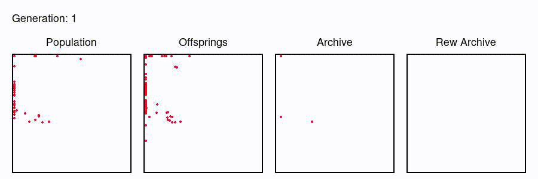

## SparsE Reward Exploration via Novelty search and Emitters

This is the repository for the SERENE algorithm introduced in the [Sparse Rewards Exploration via Novelty Search and Emitters](https://arxiv.org/abs/2102.03140) published at GECCO 2021.

You can find the instructions on how to use the code in the `README` of the repository.

---
#### Authors
Giuseppe Paolo, Alexandre Coninx, Stephane Doncieux, Alban Laflaquière

**Contact:** giuseppe.paolo93@gmail.com

### Abstract

Reward-based optimization algorithms require both exploration, to find rewards, and exploitation, to maximize performance. The need for efficient exploration is even more significant in sparse reward settings, in which performance feedback is given sparingly, thus rendering it unsuitable for guiding the search process. In this work, we introduce the SparsE Reward Exploration via Novelty and Emitters (SERENE) algorithm, capable of efficiently exploring a search space, as well as optimizing rewards found in potentially disparate areas. Contrary to existing emitters-based approaches, SERENE separates the search space exploration and reward exploitation into two alternating processes. The first process performs exploration through Novelty Search, a divergent search algorithm. The second one exploits discovered reward areas through emitters, i.e. local instances of population-based optimization algorithms. A meta-scheduler allocates a global computational budget by alternating between the two processes, ensuring the discovery and efficient exploitation of disjoint reward areas. SERENE returns both a collection of diverse solutions covering the search space and a collection of high-performing solutions for each distinct reward area. We evaluate SERENE on various sparse reward environments and show it compares favorably to existing baselines.

---
### Exploration
#### Curling environment

 
#### HardMaze environment


#### NDofArm environment


#### AntMaze environment


### To cite
```
@article{paolo2021sparse,
  title={Sparse Reward Exploration via Novelty Search and Emitters},
  author={Paolo, Giuseppe and Coninx, Alexandre and Doncieux, Stephane and Laflaqui{\`e}re, Alban},
  journal={arXiv preprint arXiv:2102.03140},
  year={2021},
  howpublished = {\url{https://github.com/GPaolo/novelty_search_gym}}
}
```
